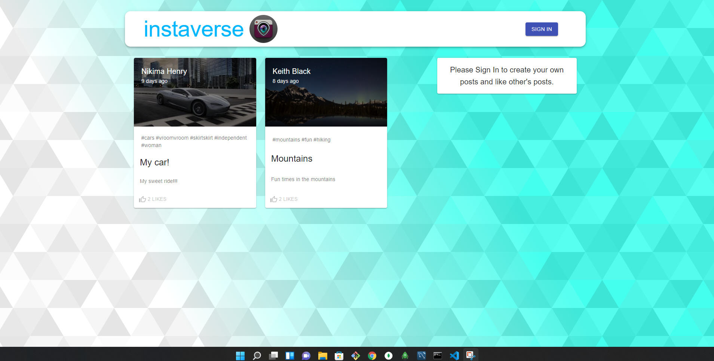
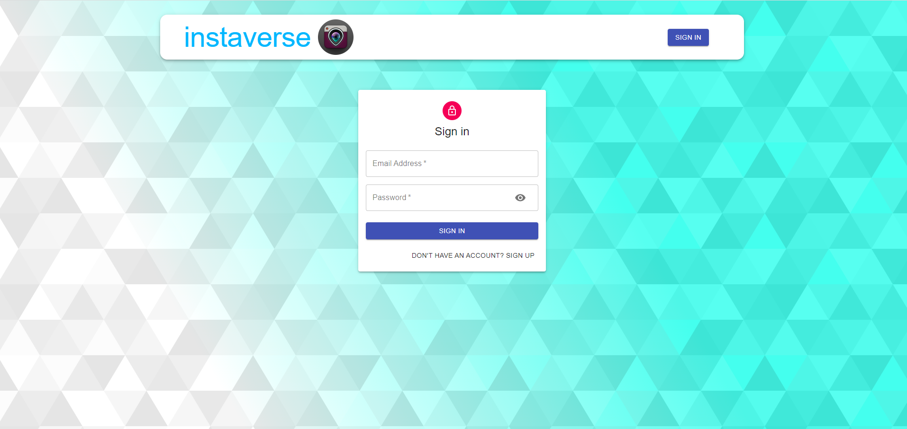
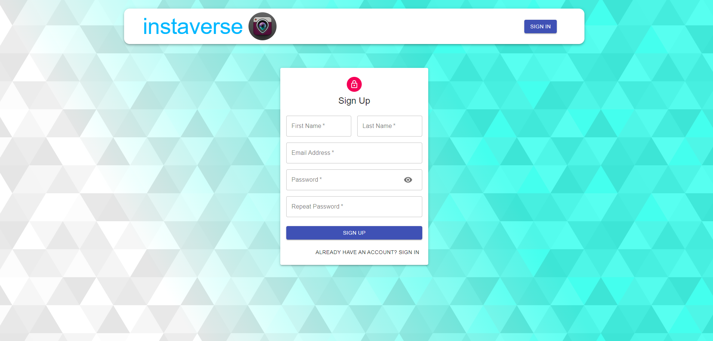
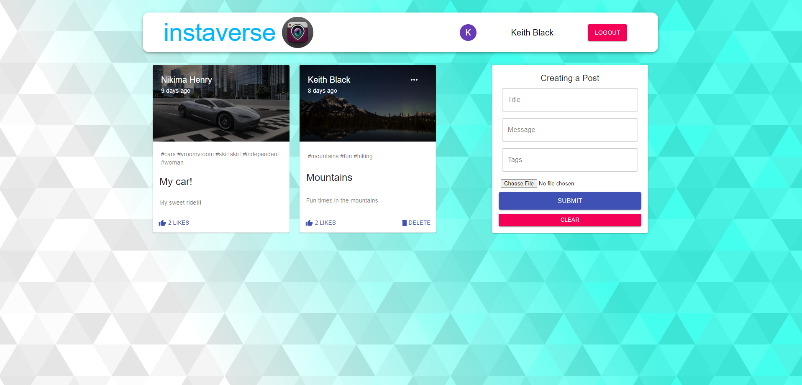

#  instaverse

## Table of Contents

- [Description](#Description)
- [Usage](#Usage)
- [Technologies](#Technologies)
- [Deployed Application](#Deployed-Application)
- [License](#License)

## Description

Instaverse is a full-stack MERN (MongoDB, Express, React, Node.js) application that allows users to create profiles, upload photos, and interact with other users' posts. Users can like, edit, and delete posts, making it an ideal platform for sharing and viewing favorite photos and experiences.

## Usage

1. **Homepage**: Upon visiting Instaverse, users are presented with a homepage displaying current posts by other users.
2. **Sign Up/Sign In**: Users must sign up or sign in to interact with posts. The sign-in button in the navigation bar leads to the sign-in form. New users can sign up by selecting the sign-up option.
3. **Create Post**: Signed-in users can create posts by filling out the create post form in their profile, selecting a photo from their local files, and submitting the post.
4. **Edit/Delete Post**: Users can edit their posts by selecting the edit option on the top right corner of their post or delete the post by selecting the delete option.
5. **Like/Unlike Post**: Users can like other users' posts by selecting the like button. To unlike a post, users can select the like button again.

## Technologies

- [JavaScript](https://developer.mozilla.org/en-US/docs/Web/JavaScript)
- [Node.js](https://nodejs.org/en/)
- [Express](https://expressjs.com/)
- [React](https://reactjs.org/)
- [Redux](https://redux.js.org/)
- [axios](https://www.npmjs.com/package/axios)
- [React File Base64](https://www.npmjs.com/package/react-file-base64)
- [MongoDB](https://www.mongodb.com/)
- [mongoose](https://www.npmjs.com/package/mongoose)
- [dotenv package](https://www.npmjs.com/package/dotenv)
- [bcrypt package](https://www.npmjs.com/package/bcrypt)
- [express-session](https://www.npmjs.com/package/express-session)
- [Material-UI](https://mui.com/)
- [Json Web Token](https://jwt.io/)
- [Moment](https://momentjs.com/)

## Deployed Application

The application is deployed on Render. You can access it [here](https://instaverse-zzuo.onrender.com).

## Screenshots of Application

### Homepage:

### Signin Page:

### Signup Page:

### Profile Page:

### Edit:

## License

Copyright &copy; 2021 Keith Black

Permission is hereby granted, free of charge, to any person obtaining a copy
of this software and associated documentation files (the "Software"), to deal
in the Software without restriction, including without limitation the rights
to use, copy, modify, merge, publish, distribute, sublicense, and/or sell
copies of the Software, and to permit persons to whom the Software is
furnished to do so, subject to the following conditions:

The above copyright notice and this permission notice shall be included in all
copies or substantial portions of the Software.

THE SOFTWARE IS PROVIDED "AS IS", WITHOUT WARRANTY OF ANY KIND, EXPRESS OR
IMPLIED, INCLUDING BUT NOT LIMITED TO THE WARRANTIES OF MERCHANTABILITY,
FITNESS FOR A PARTICULAR PURPOSE AND NONINFRINGEMENT. IN NO EVENT SHALL THE
AUTHORS OR COPYRIGHT HOLDERS BE LIABLE FOR ANY CLAIM, DAMAGES OR OTHER
LIABILITY, WHETHER IN AN ACTION OF CONTRACT, TORT OR OTHERWISE, ARISING FROM,
OUT OF OR IN CONNECTION WITH THE SOFTWARE OR THE USE OR OTHER DEALINGS IN THE
SOFTWARE.
